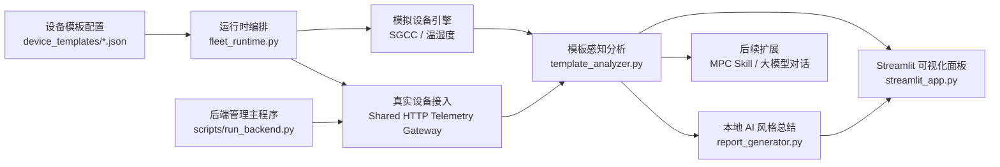

# 基于 MPC Skill 的电气设备状态监测 AI Agent 系统

面向课程设计 / 毕业设计的模板驱动监测系统，当前已经实现：

- 模拟设备与真实设备混合接入
- 本地规则分析与 AI 风格总结
- Streamlit 可视化面板
- 本地持久化设置
- 个人 PC、手机端与温湿度真实设备客户端
- 面向后续 MPC Skill / 大模型接入的扩展接口

## 项目状态

| 项目项 | 当前状态 |
| --- | --- |
| 页面演示 | 已完成 |
| SGCC 模拟设备 | 已完成 |
| 个人 PC 真实设备 | 已完成 |
| 手机端真实设备 | 已完成 |
| 温湿度真实设备 | 已完成 |
| 本地 AI 总结 | 已完成 |
| 聊天式 AI 助手 | 已支持本地规则 / 本地 Ollama / 真实模型 |
| 真实大模型接入 | 已支持后端适配 / 待配置 API Key |
| MPC Skill 平台联调 | 已完成本地 Tool/Skill 适配层 |
| backend manager | 已支持共享网关托管、健康检查、自恢复与状态快照 |
| 聊天主流程 | 已统一走 Skill adapter，并支持命令行 smoke test |
| 客户端 release 打包 | 已支持 PC 脚本 / GUI EXE 与 Android APK 构建 |

## 文档导航

项目文档已经整理到 [`doc/`](doc/README.md)：

| 文档 | 说明 |
| --- | --- |
| [`doc/README.md`](doc/README.md) | 文档总览与阅读顺序 |
| [`doc/project-architecture.md`](doc/project-architecture.md) | 项目架构说明与上下文背景 |
| [`doc/completed-features.md`](doc/completed-features.md) | 已完成功能清单 |
| [`doc/deployment-guide.md`](doc/deployment-guide.md) | 部署与使用说明 |
| [`doc/current-status.md`](doc/current-status.md) | 协作 coder 入口：当前阶段、默认运行方式、关键约束 |
| [`doc/active-plan.md`](doc/active-plan.md) | 协作 coder 入口：当前优先事项和下一步计划 |
| [`doc/dev-log.md`](doc/dev-log.md) | 近期开发日志与关键决策摘要 |
| [`doc/github-projects-guide.md`](doc/github-projects-guide.md) | 将协作文档同步到 GitHub Projects 看板的说明 |
| [`doc/optimization-qa.md`](doc/optimization-qa.md) | 自问自答式的持续优化建议与后续判断依据 |
| [`doc/development-history.md`](doc/development-history.md) | GitHub 展示版开发历史 |
| [`doc/roadmap.md`](doc/roadmap.md) | 下一阶段规划 |
| [`doc/github-publishing-guide.md`](doc/github-publishing-guide.md) | GitHub 仓库发布与展示建议 |
| [`docs/mpc_skill_guide.md`](docs/mpc_skill_guide.md) | MPC Skill 接入参考 |
| [`DEVELOPMENT_HISTORY.md`](DEVELOPMENT_HISTORY.md) | 给后续 Codex / 续会话使用的根目录上下文文件 |

## 核心架构



## 当前支持的设备模板

| 模板 ID | 类型 | 数据来源 | 主要指标 |
| --- | --- | --- | --- |
| `sgcc_simulated` | SGCC 配电设备 | 模拟 | 温度 / 电压 / 电流 |
| `personal_pc_real` | 个人 PC | 真实设备 | CPU / 内存 / 磁盘活动率 / GPU / GPU 显存 |
| `mobile_device_real` | 手机 | 真实设备 | 电量 / 电池温度 / 内存 / 存储 |
| `temp_humidity_simulated` | 温湿度设备 | 模拟 | 温度 / 湿度 |
| `temp_humidity_real` | 温湿度设备 | 真实设备 | 温度 / 湿度 |

## 快速开始

安装依赖：

```bash
pip install -r requirements.txt
```

如需启用真实模型聊天模式，请先设置环境变量：

```bash
set OPENAI_API_KEY=<你的 API Key>
```

如需启用本地 7B 模型聊天模式，可安装 `Ollama` 并拉取 `qwen2.5:7b`，然后在页面设置中把对话后端切到 `local_ollama`。

如需把当前监测摘要自动同步到 GitHub Pages，可运行：

```bash
python scripts/publish_status_snapshot.py --owner Spphire --repo DeviceSentinel-AI
```

如需快速 smoke test 聊天后端，可运行：

```bash
python scripts/check_agent_backends.py --backend local_rule --message "这台设备现在怎么样？"
```

启动页面：

```bash
streamlit run streamlit_app.py --server.port 7787
```

启动共享后端管理主程序：

```bash
python scripts/run_backend.py
```

启动个人 PC 客户端（默认打开 GUI）：

```bash
python scripts/personal_pc_client_app.py --instance-id <设备实例ID> --gateway-host <仪表盘IP> --gateway-port 10570 --gateway-path /telemetry
```

如需后台无人值守运行，可追加 `--headless`：

```bash
python scripts/personal_pc_client_app.py --instance-id <设备实例ID> --gateway-host <仪表盘IP> --gateway-port 10570 --gateway-path /telemetry --headless
```

启动手机端脚本客户端：

```bash
python scripts/mobile_device_client.py --instance-id <设备实例ID> --gateway-host <仪表盘IP> --gateway-port 10570 --gateway-path /telemetry --simulate
```

构建 PC 客户端 release：

```bash
pip install -r requirements-release.txt
python scripts/build_client_release.py --target personal_pc --format both
```

构建手机端 Android APK：

```bash
python scripts/build_mobile_android_apk.py
```

默认 APK 输出：

```text
dist/clients/mobile_android/device_sentinel_mobile_client-debug.apk
```

运行测试：

```bash
python -m pytest
```

## 目录结构

```text
DeviceSentinel-AI/
├─ android/
├─ app/
├─ device_templates/
├─ doc/
├─ docs/
├─ scripts/
├─ storage/
├─ tests/
├─ DEVELOPMENT_HISTORY.md
├─ requirements.txt
└─ streamlit_app.py
```

## GitHub 展示建议

将仓库推到 GitHub 后，建议同时配置这些项目元素：

1. 仓库描述填写为“模板驱动的电气设备状态监测 AI Agent 演示系统，支持模拟设备与真实设备混合接入”。
2. 置顶阅读入口使用本页 `README.md`。
3. 仓库 About 区补充 Topics：`streamlit`、`iot`、`ai-agent`、`mpc-skill`、`graduation-project`。
4. 使用 `doc/` 目录承载正式文档，使用根目录 `DEVELOPMENT_HISTORY.md` 保存续会话上下文。
5. 使用 `.github/` 中的 Issue / PR 模板统一后续协作记录。
