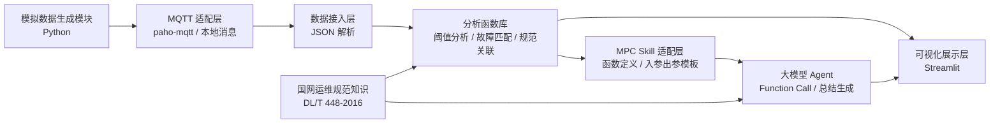

# 基于 MPC Skill 的电气设备状态监测 AI Agent 系统

本项目面向学生级毕业设计 / 课程设计，聚焦实现一条清晰可运行的核心链路：

1. Python 生成配网侧低压电气设备模拟数据
2. 通过 MQTT 形式适配上云传输场景
3. 用 Python 分析函数完成阈值判断、故障匹配、规范关联
4. 用 MPC Skill 风格的函数定义将分析能力暴露给大模型 Agent
5. 生成符合国网运维语气的智能分析报告
6. 用 Streamlit 展示设备状态、异常告警和 AI 总结

## 1. 需求对接结果

当前版本按以下边界实现：

- 先完成本地可运行闭环，不依赖真实硬件
- 数据字段固定为 `device_id`、`temperature`、`voltage`、`current`、`timestamp`
- 阈值规则优先覆盖温度、电压、电流三类典型异常
- 规范关联以 `DL/T 448-2016` 为主，保留后续扩展接口
- 阿里云 IoT 平台与百炼 MPC Skill 先提供配置模板和对接代码骨架
- 展示层使用 `Streamlit`，便于快速演示和答辩

## 2. 项目架构



## 3. 分层设计与技术栈

| 层级 | 核心功能 | 技术栈 | 输入 | 输出 |
| --- | --- | --- | --- | --- |
| 项目基础层 | 依赖管理、配置管理、阈值常量 | Python 3.11、`dataclasses`、`.env` 可扩展 | 配置参数 | 统一配置对象 |
| 数据层 | 模拟设备运行数据、MQTT 消息封装 | Python、`random`、`paho-mqtt` | 无 / 模拟控制参数 | 设备数据 JSON |
| 接入层 | 数据拉取与消息解码 | Python、JSON | MQTT / 本地输入 | 标准化设备对象 |
| 分析层 | 阈值判断、故障匹配、规范关联 | Python 纯函数 | 设备对象 | 结构化分析结果 JSON |
| MPC Skill 层 | 函数注册模板、入参与出参定义 | JSON Schema、百炼 MPC Skill 配置模板 | Agent 调用参数 | 函数执行结果 |
| Agent 层 | 生成国网风格智能总结报告 | Python 模板化报告引擎，可接入 LLM API | 分析结果 | 自然语言报告 |
| 展示层 | 状态展示、告警展示、AI 总结 | Streamlit、Pandas | 分析结果、报告 | 网页可视化 |
| 测试层 | 规则校验、演示验证 | `pytest` | 测试样本 | 测试报告 |

## 4. 开发规划表

| 阶段 | 目标 | 主要产出 | 技术栈 | 优先级 |
| --- | --- | --- | --- | --- |
| 第 1 阶段 | 搭建项目骨架和配置常量 | 目录结构、依赖文件、阈值配置 | Python | 高 |
| 第 2 阶段 | 实现模拟数据生成 | 随机设备数据、异常样本生成器 | Python、`random` | 高 |
| 第 3 阶段 | 实现核心分析函数 | 异常检测、故障分类、规范引用 | Python | 高 |
| 第 4 阶段 | 实现 MPC Skill 适配 | Skill 函数模板、参数 Schema、调用样例 | JSON、Python | 高 |
| 第 5 阶段 | 实现 Agent 报告生成 | 国网运维风格总结模板 | Python | 高 |
| 第 6 阶段 | 实现网页演示 | Streamlit 页面、表格、告警卡片 | Streamlit、Pandas | 中 |
| 第 7 阶段 | 扩展 MQTT / 阿里云接入 | 发布脚本、订阅脚本、接入说明 | `paho-mqtt` | 中 |
| 第 8 阶段 | 测试与验收 | 单元测试、演示脚本、答辩说明 | `pytest` | 高 |

## 5. 推荐目录结构

```text
SGCC_ElecDevice_Monitor_AI_MPC/
├─ app/
│  ├─ analysis/
│  ├─ agent/
│  ├─ config/
│  ├─ data/
│  ├─ mpc/
│  └─ services/
├─ docs/
├─ scripts/
├─ tests/
├─ requirements.txt
└─ streamlit_app.py
```

## 6. 本轮开发目标

本轮先完成以下内容：

- 项目基础配置
- 模拟数据生成
- Python 分析函数封装
- MPC Skill 配置模板
- 本地 Agent 报告生成
- Streamlit 演示页
- 基础测试

## 7. 运行方式

安装依赖：

```bash
pip install -r requirements.txt
```

运行命令行演示：

```bash
python scripts/run_demo.py
```

运行 MQTT 发布脚本：

```bash
python scripts/publish_simulated_data.py
```

运行 MQTT 订阅分析脚本：

```bash
python scripts/subscribe_and_analyze.py
```

运行网页演示：

```bash
streamlit run streamlit_app.py
```

运行测试：

```bash
pytest
```
