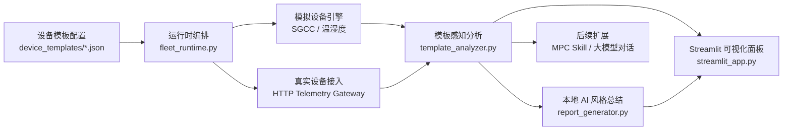

# 基于 MPC Skill 的电气设备状态监测 AI Agent 系统

面向课程设计 / 毕业设计的模板驱动监测系统，当前已经实现：

- 模拟设备与真实设备混合接入
- 本地规则分析与 AI 风格总结
- Streamlit 可视化面板
- 本地持久化设置
- 个人 PC 与温湿度真实设备客户端
- 面向后续 MPC Skill / 大模型接入的扩展接口

## 项目状态

| 项目项 | 当前状态 |
| --- | --- |
| 页面演示 | 已完成 |
| SGCC 模拟设备 | 已完成 |
| 个人 PC 真实设备 | 已完成 |
| 温湿度真实设备 | 已完成 |
| 本地 AI 总结 | 已完成 |
| 聊天式 AI 助手 | 规划中 |
| 真实大模型接入 | 规划中 |
| MPC Skill 平台联调 | 规划中 |

## 文档导航

项目文档已经整理到 [`doc/`](doc/README.md)：

| 文档 | 说明 |
| --- | --- |
| [`doc/README.md`](doc/README.md) | 文档总览与阅读顺序 |
| [`doc/project-architecture.md`](doc/project-architecture.md) | 项目架构说明与上下文背景 |
| [`doc/completed-features.md`](doc/completed-features.md) | 已完成功能清单 |
| [`doc/deployment-guide.md`](doc/deployment-guide.md) | 部署与使用说明 |
| [`doc/development-history.md`](doc/development-history.md) | GitHub 展示版开发历史 |
| [`doc/roadmap.md`](doc/roadmap.md) | 下一阶段规划 |
| [`doc/github-publishing-guide.md`](doc/github-publishing-guide.md) | GitHub 仓库发布与展示建议 |
| [`docs/mpc_skill_guide.md`](docs/mpc_skill_guide.md) | MPC Skill 接入参考 |
| [`DEVELOPMENT_HISTORY.md`](DEVELOPMENT_HISTORY.md) | 给后续 Codex / 续会话使用的根目录上下文文件 |

## 核心架构



## 当前支持的设备模板

| 模板 ID | 类型 | 数据来源 | 主要指标 |
| --- | --- | --- | --- |
| `sgcc_simulated` | SGCC 配电设备 | 模拟 | 温度 / 电压 / 电流 |
| `personal_pc_real` | 个人 PC | 真实设备 | CPU / 内存 / 磁盘活动率 / GPU |
| `temp_humidity_simulated` | 温湿度设备 | 模拟 | 温度 / 湿度 |
| `temp_humidity_real` | 温湿度设备 | 真实设备 | 温度 / 湿度 |

## 快速开始

安装依赖：

```bash
pip install -r requirements.txt
```

启动页面：

```bash
streamlit run streamlit_app.py --server.port 7787
```

启动真实设备网关：

```bash
python scripts/run_device_gateway.py --host 127.0.0.1 --port 10570 --path /telemetry
```

启动个人 PC 客户端：

```bash
python scripts/personal_pc_client.py --instance-id <设备实例ID> --host 127.0.0.1 --port 10570 --path /telemetry
```

运行测试：

```bash
python -m pytest
```

## 目录结构

```text
SGCC_ElecDevice_Monitor_AI_MPC/
├─ app/
├─ device_templates/
├─ doc/
├─ docs/
├─ scripts/
├─ storage/
├─ tests/
├─ DEVELOPMENT_HISTORY.md
├─ requirements.txt
└─ streamlit_app.py
```

## GitHub 展示建议

将仓库推到 GitHub 后，建议同时配置这些项目元素：

1. 仓库描述填写为“模板驱动的电气设备状态监测 AI Agent 演示系统，支持模拟设备与真实设备混合接入”。
2. 置顶阅读入口使用本页 `README.md`。
3. 仓库 About 区补充 Topics：`streamlit`、`iot`、`ai-agent`、`mpc-skill`、`graduation-project`。
4. 使用 `doc/` 目录承载正式文档，使用根目录 `DEVELOPMENT_HISTORY.md` 保存续会话上下文。
5. 使用 `.github/` 中的 Issue / PR 模板统一后续协作记录。
