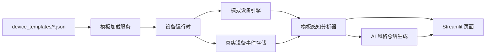

# 项目架构说明

## 1. 项目背景

本项目面向“基于 MPC Skill 的电气设备状态监测 AI Agent 系统”课程设计场景，核心目标不是堆砌复杂硬件，而是打通一条清晰可演示的链路：

1. 设备上报数据
2. 系统进行结构化分析
3. 生成自然语言结论
4. 在网页端完成监测展示
5. 为后续接入真实大模型与 MPC Skill 保留接口

## 2. 当前系统定位

当前版本已经从最初的“单一 SGCC 随机演示”升级为“模板驱动的混合设备平台”。

它支持：

- 模拟设备与真实设备并存
- 模板配置自动加载
- 指标数量动态适配
- 本地持久化设置
- 本地 AI 风格总结
- 真实设备通过 HTTP 推送遥测数据

## 3. 当前技术栈

| 层级 | 作用 | 技术栈 |
| --- | --- | --- |
| 页面层 | 实时展示、设置面板、设备详情 | Streamlit、Pandas |
| 运行时层 | 管理设备列表、推进模拟、读取真实数据 | Python |
| 模板层 | 定义设备类型、指标、协议、阈值规则 | JSON |
| 分析层 | 阈值分析、离线判定、异常总结 | Python 纯函数 |
| 总结层 | 生成 AI 风格文本报告 | Python 模板引擎 |
| 接入层 | 接收真实设备上报 | HTTP 网关 |
| 客户端层 | 向网关发送真实指标 | Python 脚本 / PowerShell 性能采样 |

## 4. 运行架构



## 5. 数据流

### 5.1 模拟设备数据流

1. 页面载入配置
2. 运行时根据模板创建模拟设备
3. 每个刷新周期推进一个模拟步长
4. 生成最新指标
5. 调用分析器形成结构化结果
6. 生成 AI 风格总结
7. 渲染设备总览、详情与曲线

### 5.2 真实设备数据流

1. 真实客户端采集本机或传感器数据
2. 客户端向本地 HTTP 网关推送 JSON
3. 网关将事件写入本地存储
4. 页面运行时读取最新事件
5. 分析器输出结构化结果
6. 页面显示最新状态与历史曲线

## 6. 目录与模块映射

| 模块 | 路径 | 说明 |
| --- | --- | --- |
| 页面入口 | `streamlit_app.py` | 主页面、设置弹窗、图表展示 |
| 模板加载 | `app/services/template_service.py` | 读取 `device_templates/*.json` |
| 设置存储 | `app/services/settings_store.py` | 本地设置加载与保存 |
| 运行时 | `app/services/fleet_runtime.py` | 混合设备运行逻辑 |
| 真实事件存储 | `app/services/real_device_store.py` | 真实遥测事件文件 |
| SGCC 分析 | `app/analysis/analyzer.py` | SGCC 规则判断 |
| 模板分析 | `app/analysis/template_analyzer.py` | 通用阈值分析与离线判定 |
| 报告生成 | `app/agent/report_generator.py` | 本地 AI 风格总结 |
| 真实设备网关 | `scripts/run_device_gateway.py` | 接收 HTTP 遥测 |
| 个人 PC 客户端 | `scripts/personal_pc_client.py` | CPU / 内存 / 磁盘活动率 / GPU 上报 |

## 7. 当前约束

- 暂未接入真实大模型 API
- 暂未做聊天式问答 UI
- 真实设备接入目前以本地 HTTP 网关为主
- 本地存储仍以 JSON 文件为主，尚未引入数据库

## 8. 给后续协作者的极简上下文

下面这段适合在新会话里直接复用：

```text
这是一个模板驱动的电气设备状态监测 AI Agent 演示系统。
页面入口是 streamlit_app.py，设备模板在 device_templates，设置保存在 storage/dashboard_settings.json。
当前支持 SGCC 模拟设备、个人 PC 真实设备、温湿度模拟设备、温湿度真实设备。
系统已有模板加载、混合运行时、阈值分析、本地 AI 总结和 Streamlit 展示。
下一步重点是聊天式 AI 助手、真实大模型接入和 MPC Skill 联调。
```
